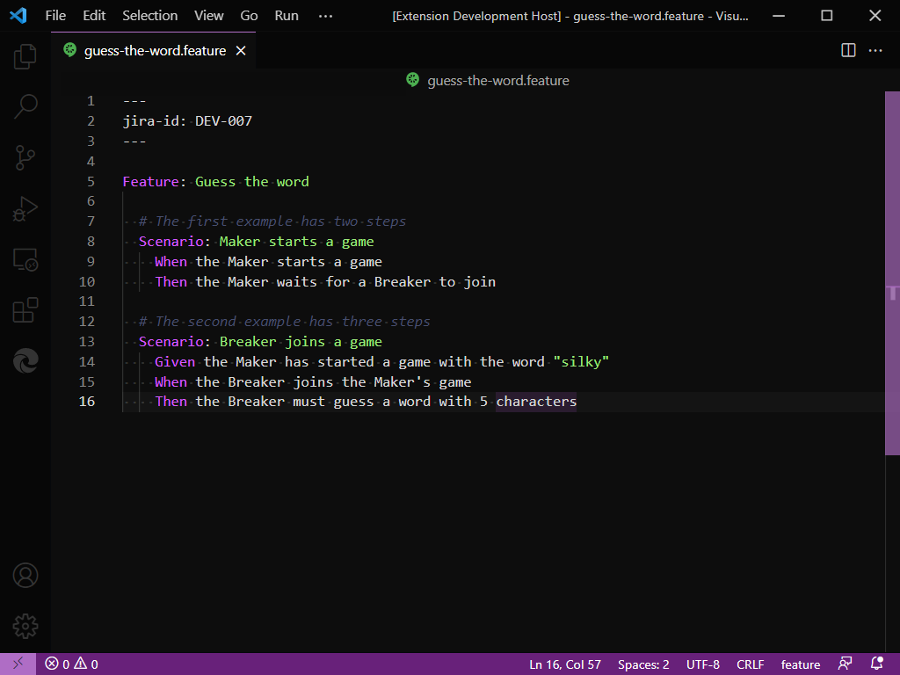
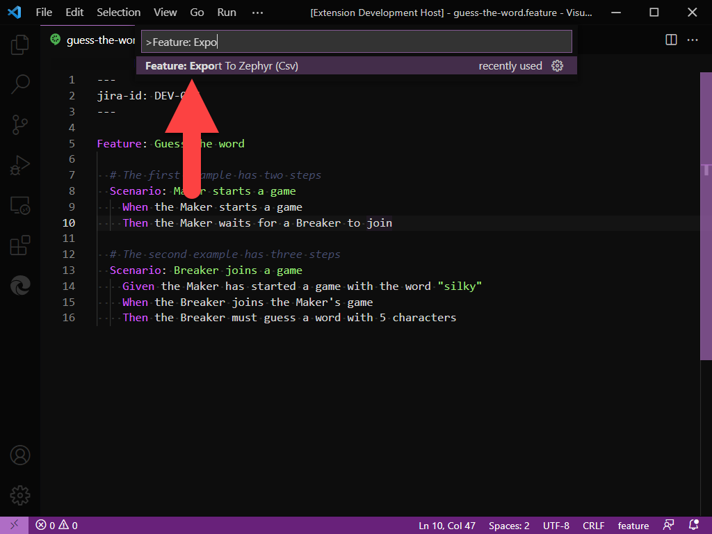
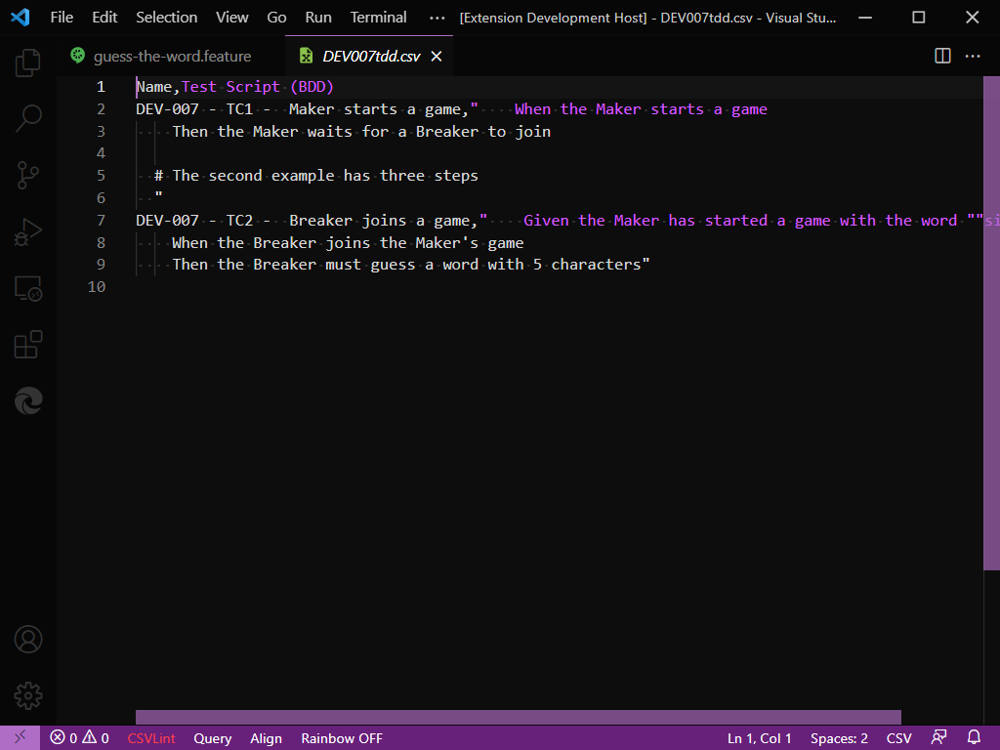

# gherkin-feature-csv-transform README

Exports a Gherkin Feature file to a CSV file suitable for importing into Zephyr Scale on Jira.

## Features

**Feature: Export To Zephyr (Csv) Command**

This command will export each Scenario in the feature as a csv row. The Name is auto generated from the jira-id in the front matter and an auto incremented counter.

The format of the name is `{JIRA-ID} - TC{TEST-CASE-NUMBER} - {SCENARIO}`

